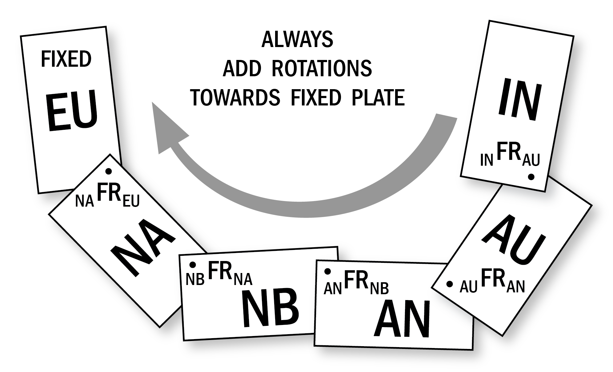

```@meta
CurrentModule = PlateKinematics
```

# Concatenate Finite Rotations

At time it may be useful to obtain the relative motion between two plates that do not share a divergent margin, or no boundary at all for that matter. The lack of common fracture zones and isochrons produces by a shared spreading center prevents the direct observation of the relative tectonic history between both plates. 

This obstacle can be circunvented by using a plate circuit that links both plates, say India and Eurasia, by a series of well-defined relative plate motion reconstructions. To connect the India plate to the Eurasian one, one may use the total reconstruction poles of Eurasia/North-America, North-America/Nubia, Africa/Antarctica, Antarctica/Australia and Australia/India.

This examples is taken from the book [Plate Tectonics: How it works](https://www.wiley.com/en-us/Plate+Tectonics%3A+How+It+Works-p-9781444314212) from Allan Cox, and provides on how to calculate the relative motion between plates that do not share a divergent boundary. All the other plate-pairs mentioned do share a common spreading center, which allows researcher to estimate opening rates of the ocean floor from the magnetic lineations parallel to the ridge.



Plate circuit example. Modified from [Plate Tectonics: How it works](https://www.wiley.com/en-us/Plate+Tectonics%3A+How+It+Works-p-9781444314212).

In terms of Finite Rotations (ROT), one would pose the circuit as:


```math
sklmdl \text{sklmdl_{rrr}} {}_{EU}FR_{IN} = \frac{4}{3}\pi r^3
```

Note how subscript are meant to indicate the fixed plate on each relative motion. $${}_{EU}FR_{IN}$$ <sub>EU</sub>ROT<sub>IN</sub> is the finite rotation describing the motion of Eurasia relative to a fixed India plate.
